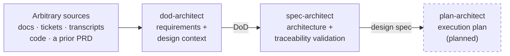

# XCODA AI Marketplace

Claude Code plugin marketplace for scoping and designing implementations.

## Philosophy

Getting from idea to code asks three questions — *what and why*, *how is it shaped*, and
*when and in what order* — and answering them in one document produces a worse version of
each: requirements that smuggle in architecture decisions nobody reviewed as decisions,
designs that are really just task lists with extra prose, milestone plans that reopen "why
are we building it this way" arguments that should've been settled two documents ago.

So each plugin owns exactly one question and explicitly refuses the other two.
`dod-architect` will not design your architecture; `spec-architect` will not sequence your
rollout. That's not a limitation to work around — asking either to do the other's job is
where these artifacts go wrong.

## Plugins



| Plugin | Answers | Status |
|---|---|---|
| [`dod-architect`](plugins/dod-architect) | **What and why?** Authors a Definition of Done from whatever sources exist — docs, transcripts, tickets, code, a prior PRD. Mines them for architecture-shaping constraints, not just behavior, each paired with a design implication and labeled by provenance (`Source:` / `Derived from:` / `Must not break:`). | Available |
| [`spec-architect`](plugins/spec-architect) | **How is it shaped?** Turns a DoD (or a plain request) into a verified architecture spec — components, data flow, interfaces — with a validator that fails closed on any traceability gap. | Available |
| `plan-architect` | **When, and in what order?** Turns a validated design into an execution plan, defaulting to walking-skeleton milestones rather than component-by-component phases that defer integration risk to the end. | Planned |

Each arrow is a real handoff — `spec-architect` mines an existing DoD rather than reinventing
acceptance criteria, and `plan-architect` will mine a validated design the same way. You don't
need the whole pipeline every time; start wherever the actual uncertainty is.

## Installation

```bash
claude plugin marketplace add XCODA-Consulting/xcoda-ai-marketplace
claude plugin install dod-architect@xcoda-ai-marketplace
claude plugin install spec-architect@xcoda-ai-marketplace
```

## Quickstart

**1. Author the DoD from whatever sources exist.**

```
Create a DoD for webhook retry delivery. Here's the design brainstorm doc, and the
customer escalation thread that started this.
```

Both sources get read in full; the constraints they imply become design implications (the
escalation's "a way to tell it's the same event" → deliveries need a stable event ID across
retries), each requirement labeled by provenance.

**2. Hand the DoD to spec-architect.**

```
Spec the architecture for webhook retry delivery. Here's the DoD: @webhook-retry-dod.md
```

Research → Blueprint → Requirements → Design → Validation, with a gate per phase.
Requirements are mined from the DoD rather than reinvented; each component declares a
`**Satisfies**: R1.1, R2.3` line naming what it is on the hook for. The final phase runs
`validate_spec.py`, which exits non-zero on any uncovered criterion, dangling reference,
component-naming drift, or uncited research claim — a passing `validation.md` means the
design is ready, not just written.

**3. Plan the rollout** — manual for now, from `design.md` + `validation.md`, until
`plan-architect` exists.

Full worked examples live in each plugin's `reference/ExampleRun.md`.

## License

MIT — see [LICENSE](LICENSE).

## Acknowledgements

The idea of driving a spec through gated phases with a machine-checked traceability pass was
prompted by [specification-document-generator](https://github.com/adrianpuiu/specification-document-generator).
The templates, conventions and validator in `spec-architect` are independent work.
