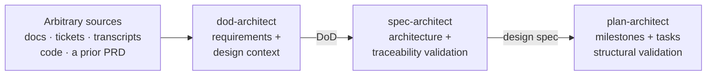

# XCODA AI Marketplace

Plugin marketplace for Claude, Codex, and ChatGPT, for scoping, designing, and sequencing implementations.

All three plugins share the same skills, references, and Python tools across hosts. The repository
provides a Claude catalog in `.claude-plugin/marketplace.json` and an OpenAI catalog in
`.agents/plugins/marketplace.json`; both point to the same plugin folders.

## Philosophy

Getting from idea to code asks three questions — *what and why*, *how is it shaped*, and
*when and in what order* — and answering them in one document produces a worse version of
each: requirements that smuggle in architecture decisions nobody reviewed as decisions,
designs that are really just task lists with extra prose, milestone plans that reopen "why
are we building it this way" arguments that should've been settled two documents ago.

So each plugin owns exactly one question and explicitly refuses the other two.
`dod-architect` will not design your architecture; `spec-architect` will not sequence your
rollout; `plan-architect` will not redesign the system. Each artifact gets reviewed
against the question it owns.

## Plugins


```mermaid
flowchart LR
    S["Arbitrary sources<br/>docs · tickets · transcripts<br/>code · a prior PRD"]
    D["dod-architect<br/>requirements +<br/>design context"]
    A["spec-architect<br/>architecture +<br/>traceability validation"]
    P["plan-architect<br/>milestones + tasks<br/>structural validation"]

    S --> D
    D -->|DoD| A
    A -->|design spec| P
```

| Plugin | Answers | Status |
|---|---|---|
| [`dod-architect`](plugins/dod-architect) | **What and why?** Authors a Definition of Done from whatever sources exist — docs, transcripts, tickets, code, a prior PRD. Mines them for architecture-shaping constraints, not just behavior, each paired with a design implication and labeled by provenance (`Source:` / `Derived from:` / `Must not break:`). | Available |
| [`spec-architect`](plugins/spec-architect) | **How is it shaped?** Turns a DoD (or a plain request) into a verified architecture spec — components, data flow, interfaces — with a validator that fails closed on any traceability gap. | Available |
| [`plan-architect`](plugins/plan-architect) | **When, and in what order?** Turns an agreed design into walking-skeleton milestones and actionable tasks, with a validator for coverage and dependency consistency. Accepts validated specs or other designs after readiness review. | Available |

Each arrow is a real handoff — `spec-architect` mines an existing DoD rather than reinventing
acceptance criteria, and `plan-architect` mines an agreed design the same way. You don't
need the whole pipeline every time; start wherever the actual uncertainty is.

## Installation

### Claude Code

```bash
claude plugin marketplace add XCODA-Consulting/xcoda-ai-marketplace
claude plugin install dod-architect@xcoda-ai-marketplace
claude plugin install spec-architect@xcoda-ai-marketplace
claude plugin install plan-architect@xcoda-ai-marketplace
```

### Codex CLI

```bash
codex plugin marketplace add XCODA-Consulting/xcoda-ai-marketplace
codex plugin add dod-architect@xcoda-ai-marketplace
codex plugin add spec-architect@xcoda-ai-marketplace
codex plugin add plan-architect@xcoda-ai-marketplace
```

Alternatively, enter `/plugins` in Codex to browse and install plugins from the configured
marketplace. Start a new session after installation to load the bundled skills.

For local development, register your checkout with `codex plugin marketplace add /absolute/path/to/xcoda-ai-marketplace`.

### ChatGPT desktop

Add the repository as a marketplace source with the Codex command above, or clone this
repository and open it as a project in Codex in the ChatGPT desktop app. The app discovers
the repo catalog at `.agents/plugins/marketplace.json`.

1. Restart the ChatGPT desktop app.
2. Open the Plugins Directory and choose **XCODA AI Marketplace** as the marketplace source.
3. Install **DoD Architect**, **Spec Architect**, **Plan Architect**, or any combination.
4. Start a new ChatGPT or Codex chat and ask for the workflow you need.

Local marketplace setup is described in the [OpenAI packaging documentation](https://developers.openai.com/plugins/build/plugins).

### ChatGPT workspace GitHub import

A workspace admin can import this marketplace for the team:

1. Open **Admin → Plugins → Add → Import marketplace**.
2. Set Source to `https://github.com/XCODA-Consulting/xcoda-ai-marketplace` and leave Path empty.
3. Leave Branch, tag, or commit empty to follow the repository's default branch, or pin a revision.
4. Import, authorize GitHub access, and review the results for all three plugins.
5. Configure each plugin's workspace installation policy and role access. Members can then
   install available plugins and start a new chat.

Workspace policies are managed in ChatGPT; repository install policies do not override them.
See [ChatGPT plugin management](https://learn.chatgpt.com/docs/enterprise/plugin-management)
for import and sync details. Workspace import provides access through supported ChatGPT
surfaces; it does not publish these plugins to the public Plugins Directory.

### Runtime requirements

- **DoD authoring** produces Markdown and needs no local CLI. Access to source material
  depends on the files and tools available in the chat.
- **Architecture validation** requires Python 3 in an environment that can execute the
  bundled script and read the generated documents. If execution is unavailable, the spec
  remains **validation pending** until the validator runs successfully.
- **Plan validation and rendering** require Python 3.9+ and filesystem/script access.
  The standard-library tool reads `plan.json` and generates `plan.md` and
  `plan-validation.md`. If execution is unavailable, the plan remains **validation pending**.
  A structural pass still requires readiness and milestone review; pending external
  prerequisites must be resolved before dependent tasks start.
- **Google Docs rendering** is optional and requires Python 3 plus an installed,
  authenticated `gws` CLI and an existing target document. A ChatGPT plugin installation
  does not install or authenticate `gws`.
- **Tracker updates** require access to the relevant tracker through the host's tools or APIs.

Plugins are supported in Codex CLI and the ChatGPT desktop app; the Codex IDE extension
does not support plugins. See [supported ChatGPT and Codex surfaces](https://learn.chatgpt.com/docs/plugins).

## Quickstart

**1. Author the DoD from whatever sources exist.**

```
Create a DoD for webhook retry delivery. Here's the design brainstorm doc, and the
customer escalation thread that started this.
```

Both sources get read in full; the constraints they imply become design implications (the
escalation's "a way to tell it's the same event" → deliveries need a stable event ID across
retries), each requirement labeled by provenance.

**2. Hand the DoD to spec-architect.**

```
Spec the architecture for webhook retry delivery. Here's the DoD: @webhook-retry-dod.md
```

Research → Blueprint → Requirements → Design → Validation, with a gate per phase.
Requirements are mined from the DoD rather than reinvented; each component declares a
`**Satisfies**: R1.1, R2.3` line naming what it is on the hook for. The final phase runs
`validate_spec.py`, which exits non-zero on any uncovered criterion, dangling reference,
component-naming drift, or uncited research claim — a passing `validation.md` means the
design is ready, not just written.

**3. Hand the design to plan-architect.**

```
Plan the implementation of webhook retry delivery from this design.md and passing
validation.md. The supporting requirements.md is included. Use walking-skeleton
milestones and break them into tasks.
```

Readiness → Milestones → Tasks → Validation, with readiness and milestone review gates.
The first slice exercises a real end-to-end integration path; later slices deepen behavior
and address failures and rollout. `plan.json` preserves the design's criterion IDs and
component names. `validate_plan.py` generates readable `plan.md` and
`plan-validation.md`, rejecting coverage gaps, dangling references, cycles, and task
dependencies that contradict milestone order. Owners, dates, and estimates stay unknown
unless supplied. Other architecture formats can enter through an explicit readiness review.

Full worked examples live in each plugin's `skills/<skill-name>/reference/ExampleRun.md`.

## License

MIT — see [LICENSE](LICENSE).

## Acknowledgements

The idea of driving a spec through gated phases with a machine-checked traceability pass was
prompted by [specification-document-generator](https://github.com/adrianpuiu/specification-document-generator).
The templates, conventions and validator in `spec-architect` are independent work.
